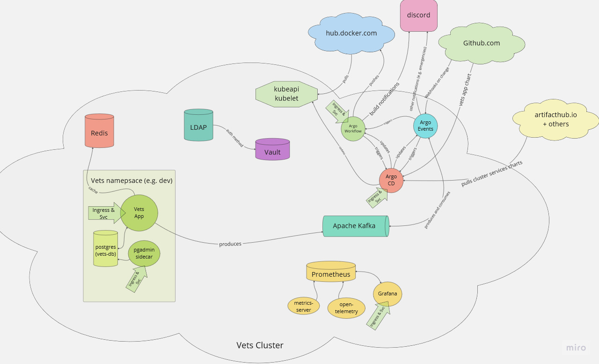

Welcome to the documentation for `fluffy-octo-telegram`. 

If you have no idea what it is, head over to the [Architecture](architecture/index.md) section which details what the actual 
application "looks like" and its functionality.  It is also where most of the design wireframes, mockups etc. are.

# Architecture diagram
At the highest level, this is what this repo contains / builds: 

# Running the project locally
You can clone the project as usual and then take a run through the [Minikube](Minikube) page which will get
you a cluster off the ground, then the [Testing](Testing) page which is the overall testing runbook for the project.

# Local dev setup
Go over to the [Development](development/index.md) section to get setup. 

# The kanban board
App feature ideas, infra ideas / issues all over [here](https://github.com/users/w3s7y/projects/2/views/1)

# Links
*note: only work if you have setup the local k8s environment*

* [vets dev environment](https://dev.vets.internal/vets/auth/login/?next=/vets/admin)
* [vets production environment](https://production.vets.internal/vets/auth/login/?next=/vets/admin)
* [argocd](https://argocd.vets.internal/)
* [argo-workflows](https://workflows.vets.internal/)
* [vault](https://vault.vets.internal/)
* [grafana](https://grafana.vets.internal/login)
* [ldap server console](https://admin.vets.internal)
* [ldap server password reset tool](https://reset.vets.internal)

## Links to documentation
* [Django core documentation](https://docs.djangoproject.com/)
* [Django rest_framework](https://www.django-rest-framework.org/)
* [minikube](https://minikube.sigs.k8s.io/docs)
* [helm](https://helm.sh/docs)
* [argo CD](https://argo-cd.readthedocs.io/en/stable/)
* [argo workflows](https://argoproj.github.io/argo-workflows/workflow-concepts/)
* [argo workflow examples](https://github.com/argoproj/argo-workflows/tree/master/examples)
* [argo events](https://argoproj.github.io/argo-events/concepts/architecture/)
* [argo event examples](https://github.com/argoproj/argo-events/tree/master/examples)
